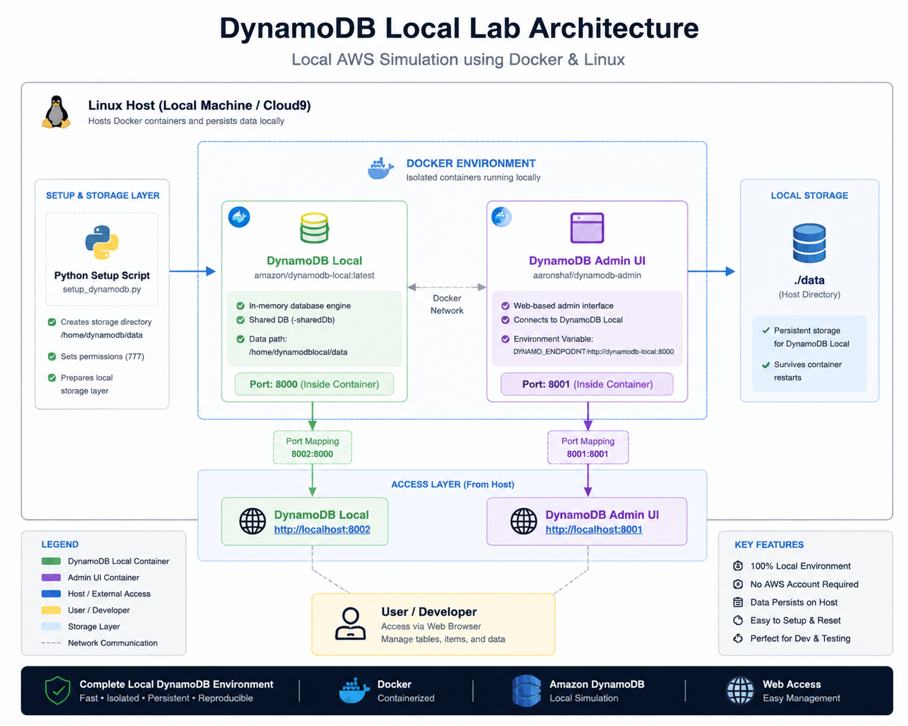

----
# ☁️ DynamoDB Local Lab — AWS Cloud Simulation (Systems Engineering Guide)

<p align="center">
  
  
  
  
  
</p>

---

A structured systems engineering lab that teaches how to deploy and operate a **local DynamoDB environment using Docker and Linux tooling**.

This project simulates real-world cloud database workflows locally, without requiring AWS access.

It is designed for:

- Backend development practice  
- DevOps / infrastructure learning  
- Distributed systems experimentation  
- API + data persistence simulation  

---

# 🚀 Quick Start (1 Command Setup)

```bash
git clone <your-repo-url>
cd dynamodb-lab
docker compose up -d
````

Access:

* [http://localhost:8001](http://localhost:8001) → DynamoDB Admin UI
* [http://localhost:8002](http://localhost:8002) → DynamoDB Local

---

# 🎓 Learning Objective

By completing this lab, you will understand:

* How Amazon Web Services DynamoDB Local emulates cloud databases
* How Docker isolates infrastructure services
* How Linux permissions affect container storage
* How backend systems persist structured data
* How local DevOps environments are structured

---

# ⚠️ Critical System Requirements

This lab will FAIL if:

* Docker is not running
* Required permissions are incorrect
* Data directory is missing
* Ports **8001** or **8002** are already in use

---

# 🧠 System Architecture

<p align="center">
  
</p>

### System Flow

```
Linux Host (Local Machine / Cloud9)
↓
Python Setup Script (creates storage layer)
↓
Docker Compose (orchestrates services)
↓
DynamoDB Local (port 8002)
↓
DynamoDB Admin UI (port 8001)
↓
Browser Interface (testing + verification)
```

---

# 🧰 Prerequisites

Run the following checks before starting:

```bash
docker --version
docker compose version
python3 --version
whoami
```

If any command fails → STOP and fix before continuing.

---

# 📁 Step 1 — Create Workspace

```bash
cd ~
mkdir -p dynamodb-lab
cd dynamodb-lab
```

---

# 🐍 Step 2 — Storage Setup Script

Create file:

```bash
nano setup_dynamodb.py
```

Paste:

```python
import os

def setup_dynamodb_local():
    # Define local storage path
    dynamodb_data_path = "/home/dynamodb/data"

    try:
        # Create directory (mkdir -p equivalent)
        os.makedirs(dynamodb_data_path, exist_ok=True)
        print(f"[OK] Directory ready: {dynamodb_data_path}")

        # Set full permissions (lab simplicity)
        os.chmod(dynamodb_data_path, 0o777)
        print(f"[OK] Permissions set: 777")

    except PermissionError:
        print("[ERROR] Run this script with sudo privileges")

    except Exception as e:
        print(f"[ERROR] {e}")

if __name__ == "__main__":
    setup_dynamodb_local()
```

Run:

```bash
sudo python3 setup_dynamodb.py
```

---

# ⚙️ Step 3 — Docker Compose Setup

Create file:

```bash
nano docker-compose.yml
```

Paste:

```yaml
version: "3.8"

services:

  dynamodb-local:
    image: amazon/dynamodb-local:latest
    container_name: dynamodb-local

    command: "-jar DynamoDBLocal.jar -sharedDb -dbPath /home/dynamodblocal/data"

    ports:
      - "8002:8000"

    volumes:
      - "./data:/home/dynamodblocal/data"

    restart: always

  dynamodb-admin:
    image: aaronshaf/dynamodb-admin
    container_name: dynamodb-admin

    depends_on:
      - dynamodb-local

    ports:
      - "8001:8001"

    environment:
      DYNAMO_ENDPOINT: http://dynamodb-local:8000
      AWS_REGION: us-east-1

    restart: always
```

---

# 🧪 Step 4 — Initialize Storage

```bash
mkdir -p ./data
chmod -R 777 ./data
```

---

# 🐳 Step 5 — Start System

```bash
docker compose up -d
```

Check containers:

```bash
docker ps
```

Expected:

* dynamodb-local
* dynamodb-admin

---

# 🌐 Step 6 — Access Interfaces

| Service           | URL                                            |
| ----------------- | ---------------------------------------------- |
| DynamoDB Local    | [http://localhost:8002](http://localhost:8002) |
| DynamoDB Admin UI | [http://localhost:8001](http://localhost:8001) |

---

# 🧪 Step 7 — Validation Test

```bash
curl http://localhost:8002
```

Expected:

* Service response confirming DynamoDB is running

---

# 📌 Common Issues (Troubleshooting Guide)

---

## ❌ 1. Port already in use (8001 / 8002)

```bash
sudo lsof -i :8001
sudo lsof -i :8002
```

Fix:

```bash
kill -9 <PID>
```

Or restart:

```bash
docker compose down
docker compose up -d
```

---

## ❌ 2. Docker not running

```bash
sudo systemctl status docker
```

Fix:

```bash
sudo systemctl start docker
```

---

## ❌ 3. Permission issues on data folder

```bash
sudo chmod -R 777 ./data
```

Reset if needed:

```bash
rm -rf ./data
mkdir ./data
```

---

## ❌ 4. Admin UI cannot connect

Verify:

```yaml
DYNAMO_ENDPOINT: http://dynamodb-local:8000
```

Ensure both containers are running in same compose network.

---

## ❌ 5. Container starts but fails silently

Check logs:

```bash
docker logs dynamodb-local
```

Reset system:

```bash
docker compose down -v
docker compose up -d
```

---

# 🧠 Why This Lab Exists

Modern backend systems require:

* reproducible environments
* isolated database layers
* safe testing infrastructure
* local cloud simulation

This lab recreates real AWS-style architecture behavior locally.

---

# 👨‍💻 Author

**TCDOverlord**

GitHub: [https://github.com/tcdoverlord](https://github.com/tcdoverlord)

---

# 🚀 Final Result

After completion, you will have:

* A fully working local DynamoDB environment
* A web-based admin interface
* A reproducible DevOps lab setup
* A strong foundation for backend engineering workflows

----
